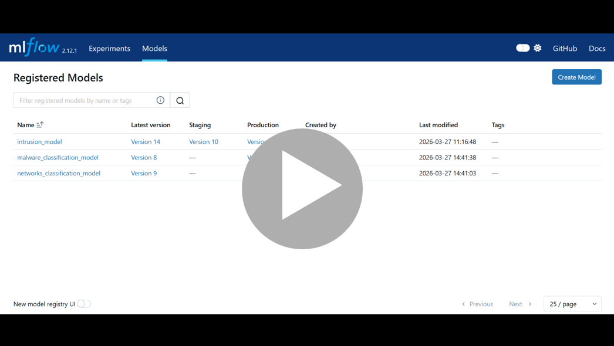
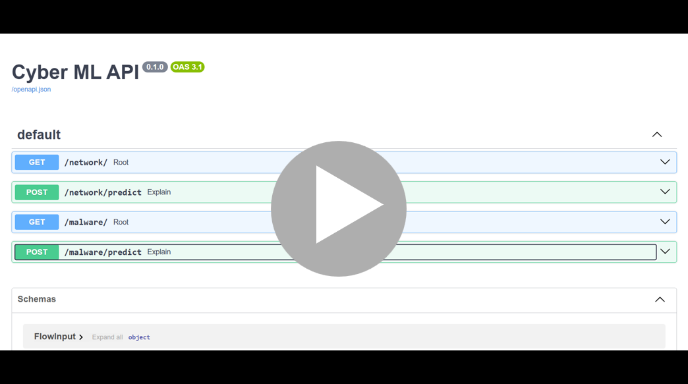
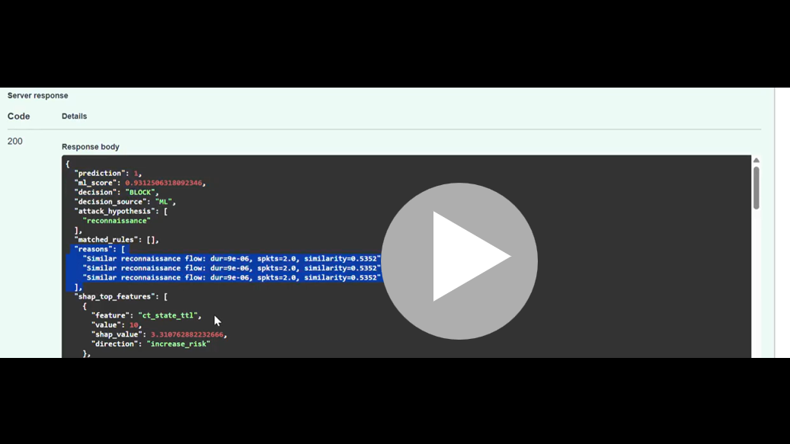

# Real-Time Multi-Domain Cyber AI Platform

## Overview

This project is a multi-domain machine learning platform for cybersecurity, designed to train and deploy models across different domains such as:

* Malware detection (static PE analysis – EMBER Dataset)
* Network classification detection (streaming via Spark + Kafka - UNSW-NB15 Dataset)

The system supports modular training pipelines and allows selecting which domain to train using a unified interface.

The system integrates a Retrieval-Augmented Generation (RAG) layer using Pinecone as a vector database, along with AI Agents orchestration (LangGraph), to provide contextual validation, reasoning, and explanation for model decisions.

It enables detection of known vs. novel attacks by combining ML predictions with similarity-based reasoning over historical flows.

---
## System Demo

### BOTH Training + MLflow Production Promotion

This demo showcases a multi-domain training pipeline running in `both` mode.  
It trains two independent models: one for network attacks classification and one for malware classification, each using its own data pipeline and feature engineering.

At the end of the run, all experiments are logged to MLflow, and the best-performing model is automatically promoted to `Production`.


[](https://youtu.be/viFWanNg0rY)

### API Demo (Swagger UI)

This demo shows the REST API usage via Swagger UI, including `/malware/predict` inference and real-time explanation with SHAP.

[](https://youtu.be/85oFoRoMe1c)

---
### RAG Demo (Swagger UI)

This demo shows `/network/predict` inference with RAG validation.  
For high-confidence detections with uncertain attack type, the system retrieves top-3 similar flows (k=3) to refine the attack hypothesis.

[](https://youtu.be/P7qIM-kIeJI)

---

## Key Idea

A single training service supports multiple domains:

```
User → run.py (--mode) → Domain Pipeline → Model Training → Evaluation → MLflow Registry
```

---

## Supported Modes

```bash
python run.py --mode <mode>
```

| Mode     | Description                           |
| -------- | ------------------------------------- |
| networks | Train network classification model    |
| malwares | Train malware classification model    |
| both     | Train both pipelines sequentially     |

---

## System Architecture

### Offline Training Pipeline

```
Data → Feature Engineering → Clean Features → Train/Val/Test Split
     → Model Training (XGBoost)
     → Evaluation → Feature Importance
     → MLflow Logging → Model Registry
```

### Infrastructure

* Docker Compose
* MLflow (tracking + registry)
* Kafka (streaming)
* Spark (network pipeline)

---

## Project Structure

```
training/
├── malwares/
│   ├── train.py
│   ├── features.py
│
├── networks/
│   ├── train.py
│
├── common/
│   ├── utils.py
│
├── run.py
```

---

## Running the Training

From the infrastructure folder:

```bash
docker compose run training python run.py --mode malwares
```
---

## Model Performance

```
Accuracy: 0.93
ROC AUC: 0.9745

Class 0 (Benign):
Precision: 0.92 | Recall: 0.88 | F1: 0.90

Class 1 (Malware):
Precision: 0.94 | Recall: 0.96 | F1: 0.95
```
---

## Feature Importance - Malware

```
Top 10 Most Important Features (XGBoost):

general.has_debug                              0.317
general.has_relocations                        0.081
header.optional.sizeof_heap_commit             0.072
general.exports                                0.066
header.optional.major_subsystem_version        0.059
header.optional.major_operating_system_version 0.044
header.optional.minor_operating_system_version 0.041
general.has_resources                          0.037
general.imports                                0.031
header.optional.minor_subsystem_version        0.030
```
---

## Key Insights (XGBoost + SHAP)

From feature importance and SHAP analysis, we learned:

* **has_debug** → absence increases risk (malware hides debug info)
* **has_relocations** → presence decreases risk (legitimate, ASLR-friendly binaries)
* **sizeof_heap_commit** → very small values increase risk, larger values indicate real applications
* **exports** → few exports = suspicious, many = legitimate behavior
* **imports** → low imports suggest minimal/hidden functionality → higher risk
* **OS / subsystem versions** → outdated versions increase risk, modern versions reduce it
* **has_resources** → absence increases risk (malware often strips resources)
---

## Example Insights

### Malware Sample

* No debug info
* Few imports
* Old OS version

→ **High risk (BLOCK)**

---

### Benign Sample

* Has debug info
* Many imports/exports
* Modern OS version

→ **Low risk (ALLOW)**

---

## Model Lifecycle (MLflow)

* Automatic model registration
* Versioning (v1, v2, v3, ...)
* Promotion to production

Example:

```
Model 4 → Production
```
---
## Running Network Training

From the infrastructure folder:

```bash
docker compose run training python run.py --mode networks
```
---

## Example Training Output (Networks)

```text
Mode selected: networks
Running NETWORKS training...

Loading full date: /app/output/unsw_stream/date=2026-03-21
Loading /app/output/unsw_stream/date=2026-03-21/hour=13
Loading /app/output/unsw_stream/date=2026-03-21/hour=14

Train hours: [13]
Test hour: 14
```

---

## Model Behavior (Probability Distribution)

```text
min: 0.0022
max: 0.9335
mean: 0.1009

Chosen threshold: 0.6
Precision at threshold: 1.0
```

### Interpretation

* Most traffic is low-risk (low probability)
* High-confidence anomalies are clearly separated
* Threshold tuning prioritizes high recall with strong precision

---

## Feature Importance (Network Model)

```text
Top 10 Most Important Features (XGBoost - Networks):

sttl              0.677
ct_state_ttl      0.304
ct_dst_ltm        0.004
dttl              0.002
ct_src_ltm        0.001
sbytes            0.001
load_ratio        0.001
byte_ratio        0.001
smeansz           0.0009
sjit              0.0007
```

### Interpretation

The model relies heavily on TTL-based features:

* `sttl`, `dttl` → packet routing characteristics
* `ct_state_ttl` → connection state + TTL behavior
* `ct_*` features → connection frequency patterns

These signals are highly effective for detecting:

* Network scanning
* Spoofing
* Abnormal routing behavior

---

## Model Performance

```text
Accuracy: 0.97

Class 0 (Normal):
Precision: 1.00 | Recall: 0.97 | F1: 0.98

Class 1 (Attack):
Precision: 0.72 | Recall: 1.00 | F1: 0.84
```

---

## Confusion Matrix

```text
[[23957   798]
 [    2  2043]]
```

### Interpretation

* Very high recall (almost no missed attacks)
* Some false positives (acceptable in security systems)

---

## Model Lifecycle (MLflow + Promotion Logic)

```text
Model version 6 → Production
```

### Promotion Strategy

The model is promoted only if:

* Recall ≥ previous production model
* Precision does not degrade significantly
* Latency constraints are met

---

## Deployment Artifacts

* Model saved locally:

```text
/app/models/<timestamp>/intrusion_model.joblib
```

* Uploaded to S3:

```text
s3://intrusion-ml-models/models/intrusion/<timestamp>
```

* Latest model pointer:

```text
models/intrusion/latest/model.joblib
```
---
---
## RAG Layer (Contextual Validation with Pinecone)

The system includes a Retrieval-Augmented Generation (RAG) component to enhance decision reliability.

Instead of relying solely on model predictions, the system retrieves similar historical flows from a Pinecone vector database to validate and enrich the prediction.

### How it works

1. Convert incoming network flow into an embedding
2. Query Pinecone vector database (top-k similar flows)
3. Retrieve similar attack patterns
4. Use retrieved context to:
   - Refine attack hypothesis
   - Provide human-readable explanations
   - Support decision confidence

### Why it matters

- Reduces uncertainty in attack classification  
- Adds explainability beyond raw model output  
- Mimics real analyst reasoning (compare with past incidents)

---

### Offline Pipeline (RAG Indexing)
```
Raw Network Flows
        ↓
Feature Extraction
        ↓
Embedding Model (SentenceTransformer)
        ↓
Vector Representation (Dense Embeddings)
        ↓
Pinecone Vector DB (Index Storage)
        ↓
Ready for Retrieval
```
---
### Online Pipeline (RAG Inference)
```
Incoming Flow (API)
        ↓
ML Model (Prediction + SHAP)
        ↓
Trigger RAG (if high-confidence attack)
        ↓
Build Query (from features + SHAP)
        ↓
Embedding Model
        ↓
Pinecone Search (Top-K = 3)
        ↓
Retrieve Similar Flows
        ↓
Similarity Analysis + Pattern Matching
        ↓
Final Decision + Explanation (ML + RAG)
```
---

## RAG - Seeding Vector Database (Pinecone)

Before running the system, we populate the vector database with historical network flows.

This step converts raw flows into embeddings and stores them in Pinecone for later retrieval (RAG).

---

### Dataset Distribution

Example distribution (balanced subset):

```text id="h7k2dp"
fuzzers         50
exploits        50
reconnaissance  50
normal          50
generic         50
dos             26
analysis        11
backdoor         8
shellcode        5
worms            2
```

---

### ⚠️ Note on Dataset Size

This demo uses a **small subset (~300 flows)** due to limited local resources (CPU / memory).

However, the system is fully scalable:

* Can easily handle **tens or hundreds of thousands of flows**
* Simply increase the dataset size in `seed_pinecone.py`
* Pinecone + embeddings pipeline remains unchanged

---

### Run Seeding

```bash id="k3jv9s"
docker compose run --rm inference python network/seed_pinecone.py
```

---

### What happens

```text id="n2xq4m"
Load data → Encode (SentenceTransformer)
         → Build embeddings (302 vectors)
         → Upload to Pinecone
```
---

### Example Output

```text id="p9lq2t"
Loaded 302 rows
Encoding...
Batches: 100% | 10/10
Embeddings shape: 302
Built 302 vectors
Done seeding 302 flows into Pinecone
```
---

### Why this step is required

* Enables **RAG retrieval** of similar flows
* Provides **historical context** for predictions
* Allows detection of **known vs. novel attacks**

---

👉 This step must be completed before running inference with RAG.

---

## RAG-Based Context Validation

The system enriches ML predictions with a **Retrieval-Augmented Generation (RAG)** layer that retrieves similar historical flows and explains the decision.

RAG is triggered when:

```text
prediction = 1 AND ml_score > 0.8
```

---

### Input

```json
{
  "sttl": 254,
  "dttl": 252,
  "ct_state_ttl": 10,
  "dbytes": 0
}
```

---

### Output

```json
{
  "prediction": 1,
  "ml_score": 0.9312506318092346,
  "decision": "BLOCK",
  "decision_source": "ML",
  "attack_hypothesis": [
    "reconnaissance"
  ],
  "matched_rules": [],
  "reasons": [
    "Similar reconnaissance flow: dur=9e-06, spkts=2.0, similarity=0.5352",
    "Similar reconnaissance flow: dur=9e-06, spkts=2.0, similarity=0.5352",
    "Similar reconnaissance flow: dur=9e-06, spkts=2.0, similarity=0.5352"
  ],
  "shap_top_features": [
    {
      "feature": "ct_state_ttl",
      "value": 10,
      "shap_value": 3.310762882232666,
      "direction": "increase_risk"
    },
    {
      "feature": "sttl",
      "value": 254,
      "shap_value": 3.190727710723877,
      "direction": "increase_risk"
    },
    {
      "feature": "ct_dst_ltm",
      "value": 6.740434782608696,
      "shap_value": -0.6148238778114319,
      "direction": "decrease_risk"
    },
    {
      "feature": "ct_src_ltm",
      "value": 6.811739130434782,
      "shap_value": -0.24214786291122437,
      "direction": "decrease_risk"
    },
    {
      "feature": "ct_src_dport_ltm",
      "value": 3.727826086956522,
      "shap_value": -0.22448688745498657,
      "direction": "decrease_risk"
    }
  ],
  "rag_query": "...",
  "rag_context": [
    {
      "attack_label": "reconnaissance",
      "dur": 0.000009,
      "spkts": 2,
      "similarity": 0.535
    }
  ],
  "rag_analysis": {
    "summary": "Decision BLOCK with weak supporting evidence.",
    "avg_similarity": 0.535,
    "confidence": "low"
  },
  "rag_support": "weak"
}
```

---

### How it works

```text
Flow → ML (prediction + SHAP)
     → Build query from features
     → Retrieve similar flows (Pinecone)
     → Analyze similarity + attack patterns
     → Attach contextual explanation
```

---

### Key Insight

* **ML confidence is high (0.93) → strong classification signal**
* **RAG similarity is low (~0.53) → weak historical support**

→ The system identifies:

> **A likely attack with low similarity to known patterns (possible new / unseen attack)**

---

### Why this matters

* Prevents blind trust in ML predictions
* Distinguishes **known vs. novel attacks**
* Adds **explainability + context** to every decision

---

---
# Network Prediction API

FastAPI service for real-time network traffic classification, inspired by firewall systems.

### POST `/predict`
---

# Examples (Execution Order)

## 1. Normal Traffic (ML)

### Request

```json
{
  "sttl": 31,
  "dttl": 29,
  "ct_state_ttl": 0,
  "dload": 500000
}
```

### Response

```json
{
  "prediction": 0,
  "ml_score": 0.0022239708341658115,
  "decision": "ALLOW",
  "decision_source": "ML",
  "attack_hypothesis": [],
  "reasons": []
}
```

---

## 2. Attack (ML)

### Request

```json
{
  "sttl": 254,
  "dttl": 252,
  "ct_state_ttl": 1,
  "dbytes": 0
}
```

### Response

```json
{
  "prediction": 1,
  "ml_score": 0.9312506318092346,
  "decision": "BLOCK",
  "decision_source": "ML",
  "attack_hypothesis": [],
  "reasons": []
}
```

---

## 3. DoS Attack (RULE)

### Request

```json
{
  "spkts": 200,
  "sload": 120000,
  "sintpkt": 0.0005
}
```

### Response

```json
{
  "decision": "BLOCK",
  "decision_source": "RULE",
  "attack_hypothesis": ["DoS"],
  "reasons": [
    "High traffic rate that may overload the system."
  ],
  "explanations": [
    "This rule is used to detect Denial of Service behavior. It looks for very high packet volume, high traffic load, and very short time between packets. Together, these signals may indicate an attempt to flood the target and reduce its availability."
  ]
}
```

---

## 4. Reconnaissance (RULE)

### Request

```json
{
  "spkts": 60,
  "ct_src_dport_ltm": 5,
  "sintpkt": 0.01
}
```

### Response

```json
{
  "decision": "ALERT",
  "decision_source": "RULE",
  "attack_hypothesis": ["Reconnaissance"],
  "reasons": [
    "Suspicious scanning behavior indicating reconnaissance activity."
  ],
  "explanations": [
    "This rule detects reconnaissance activity such as port scanning or probing. It looks for a high number of packets sent, multiple destination ports, and short intervals between packets."
  ]
}
```
---
## Malware Prediction API

### POST /malware/predict

Classifies a file as malware or benign using static PE features.

### Request

```json
{
  "general.has_relocations": 1,
  "general.imports": 120,
  "general.size": 289344,
  "strings.entropy": 5.8,
  "strings.numstrings": 1200,
  "header.coff.timestamp": 1588348800,
  "header.optional.sizeof_code": 20480,
  "header.optional.major_linker_version": 9
}
````

### Response

```json
{
  "prediction": 1,
  "ml_score": 0.59,
  "decision": "BLOCK",
  "decision_source": "ML",
  "shap_top_features": [
    {
      "feature": "general.has_resources",
      "shap_value": 1.26,
      "direction": "increase_risk"
    }
  ]
}
```

### Notes

* `prediction`: 1 = malware, 0 = benign
* `ml_score`: probability
* `decision`: final action (BLOCK / ALLOW)
* `shap_top_features`: key features influencing the prediction

```
